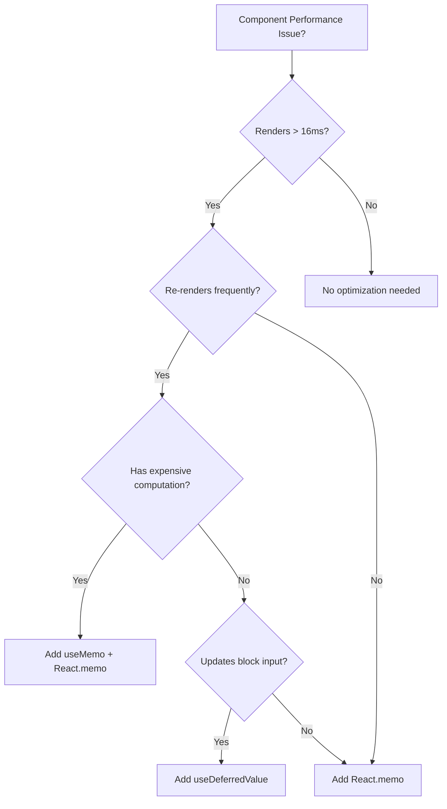

# 🚀 The Ultimate React Performance Optimization Framework

_Extracted from production-grade applications_

## Table of Contents

1. [Core Principles](#core-principles)
2. [The Performance Hierarchy](#the-performance-hierarchy)
3. [Pattern Catalog](#pattern-catalog)
4. [Decision Framework](#decision-framework)
5. [Implementation Checklist](#implementation-checklist)
6. [Anti-Patterns to Avoid](#anti-patterns-to-avoid)
7. [Measuring Success](#measuring-success)

---

## 🎯 Core Principles

### The 5 Laws of React Performance

1. **Law of Minimal Re-renders**

   - A component should only re-render when its output will change
   - Use React.memo with custom comparisons to enforce this

2. **Law of Stable References**

   - Objects, arrays, and functions should maintain stable references across renders
   - Use useMemo and useCallback to achieve stability

3. **Law of Computation Deferral**

   - Expensive computations should be deferred and memoized
   - Non-critical updates should use useDeferredValue

4. **Law of State Locality**

   - State should live as close to where it's used as possible
   - Lift state only when necessary for sharing

5. **Law of Subscription Efficiency**
   - Components should only subscribe to the exact data they need
   - Use granular selectors and shallow equality checks

---

## 📊 The Performance Hierarchy

Apply optimizations in this order for maximum impact:

```
Level 1: Component Memoization (50-70% improvement)
    ↓
Level 2: Computation Memoization (20-30% improvement)
    ↓
Level 3: Update Deferral (10-20% improvement)
    ↓
Level 4: Event Optimization (5-10% improvement)
    ↓
Level 5: Bundle Optimization (5-10% improvement)
```

---

## 📖 Pattern Catalog

### Pattern 1: React.memo with Custom Comparison

**When to use:** For any component that receives complex props

```typescript
// ❌ Bad - Re-renders on every parent update
export const Component = (props) => {
  /* ... */
};

// ✅ Good - Only re-renders when specific props change
export const Component = React.memo(ComponentImpl, (prev, next) => {
  // Fast path: reference equality
  if (prev.data === next.data) return true;

  // Granular checks for primitives
  if (prev.id !== next.id) return false;
  if (prev.status !== next.status) return false;

  // Deep equality only for complex objects (expensive, do last)
  return isEqual(prev.items, next.items);
});
```

**Decision criteria:**

- Use when component has expensive render logic
- Use when component receives object/array props
- Skip for components that always need latest props

### Pattern 2: useMemo for Expensive Computations

**When to use:** For any computation that takes >1ms or creates new objects

```typescript
// ❌ Bad - Recalculates on every render
const processedData = data.map((item) => ({
  ...item,
  computed: expensiveFunction(item),
}));

// ✅ Good - Only recalculates when data changes
const processedData = useMemo(
  () =>
    data.map((item) => ({
      ...item,
      computed: expensiveFunction(item),
    })),
  [data]
);
```

**Decision criteria:**

- Use for array transformations (map, filter, reduce)
- Use for object creation in render
- Use for complex calculations
- Skip for simple property access

### Pattern 3: useCallback for Event Handlers

**When to use:** Only when the function is a dependency or passed to memoized children

```typescript
// ❌ Bad - Creates new function every render
const handleClick = () => {
  doSomething(value);
};

// ✅ Good - Stable function reference
const handleClick = useCallback(() => {
  doSomething(value);
}, [value]);

// 🎯 Best - Use refs for values that shouldn't trigger updates
const valueRef = useRef(value);
valueRef.current = value;
const handleClick = useCallback(() => {
  doSomething(valueRef.current);
}, []); // Empty deps - maximally stable
```

**Decision criteria:**

- Use when passed to memoized child components
- Use when in dependency arrays
- Skip for inline handlers with no dependencies

### Pattern 4: useDeferredValue for Non-Critical Updates

**When to use:** For updates that can lag behind user input

```typescript
// ❌ Bad - Everything updates synchronously
const results = searchItems(query);

// ✅ Good - Input stays responsive
const deferredQuery = useDeferredValue(query);
const results = searchItems(deferredQuery);
```

**Decision criteria:**

- Use for search results
- Use for filtering large lists
- Use for expensive visualizations
- Skip for critical user feedback

### Pattern 5: State Hoisting Prevention

**When to use:** Keep state local unless sharing is required

```typescript
// ❌ Bad - State in parent causes unnecessary re-renders
function Parent() {
  const [inputValue, setInputValue] = useState("");
  return <Child value={inputValue} onChange={setInputValue} />;
}

// ✅ Good - State stays local
function Child() {
  const [inputValue, setInputValue] = useState("");
  return (
    <input value={inputValue} onChange={(e) => setInputValue(e.target.value)} />
  );
}
```

**Decision criteria:**

- Keep state in component if only that component uses it
- Lift state only when multiple components need it
- Use context for deeply nested sharing

### Pattern 6: Granular Store Subscriptions

**When to use:** When using state management libraries

```typescript
// ❌ Bad - Subscribes to entire store
const state = useStore();

// ✅ Good - Subscribes to specific slice
const userData = useStore((state) => state.user.data);

// 🎯 Best - Multiple granular subscriptions with shallow equality
const userName = useStore((state) => state.user.name);
const userRole = useStore((state) => state.user.role);
```

**Decision criteria:**

- Always use selectors
- Use shallow equality for object selections
- Split into multiple subscriptions for granularity

### Pattern 7: Throttling and Debouncing

**When to use:** For high-frequency updates

```typescript
// For continuous streams (scrolling, mousemove)
const throttledUpdate = useThrottle(update, 100); // Max 10 updates/second

// For user input (typing, searching)
const debouncedSearch = useDebounce(search, 300); // Wait 300ms after typing stops

// For real-time data (websockets, streaming)
const throttledStream = {
  experimental_throttle: 100, // AI SDK pattern
};
```

**Decision criteria:**

- Throttle: Continuous events (scroll, resize, mousemove)
- Debounce: User input (search, validation)
- Stream throttle: Real-time data updates

### Pattern 8: Component Splitting

**When to use:** When parts of a component update at different rates

```typescript
// ❌ Bad - Entire component re-renders for input changes
function Component() {
  const [input, setInput] = useState("");
  const expensiveData = useExpensiveComputation();

  return (
    <>
      <input value={input} onChange={(e) => setInput(e.target.value)} />
      <ExpensiveVisualization data={expensiveData} />
    </>
  );
}

// ✅ Good - Split into separate components
function InputSection() {
  const [input, setInput] = useState("");
  return <input value={input} onChange={(e) => setInput(e.target.value)} />;
}

function DataSection() {
  const expensiveData = useExpensiveComputation();
  return <ExpensiveVisualization data={expensiveData} />;
}
```

### Pattern 9: Virtual Scrolling

**When to use:** For lists with >100 items

```typescript
// Use libraries like react-window or @tanstack/react-virtual
import { VirtualList } from "@tanstack/react-virtual";

// Only renders visible items + buffer
<VirtualList
  count={10000}
  height={600}
  itemHeight={50}
  renderItem={({ index }) => <Item key={index} data={items[index]} />}
/>;
```

### Pattern 10: Lazy Loading

**When to use:** For code splitting and reducing initial bundle

```typescript
// Split heavy components
const HeavyComponent = React.lazy(() => import("./HeavyComponent"));

// Split routes
const AdminPanel = React.lazy(() => import("./routes/AdminPanel"));

// Conditional features
const AdvancedEditor = React.lazy(() =>
  userHasPremium ? import("./AdvancedEditor") : import("./BasicEditor")
);
```

---

## 🤔 Decision Framework

### When to Optimize?



### Optimization Priority Matrix

| Frequency | Impact | Action                       |
| --------- | ------ | ---------------------------- |
| High      | High   | React.memo + useMemo + defer |
| High      | Low    | React.memo only              |
| Low       | High   | useMemo only                 |
| Low       | Low    | No optimization              |

---

## ✅ Implementation Checklist

### Phase 1: Identify Hot Spots (1 hour)

- [ ] Run React DevTools Profiler
- [ ] Identify components rendering >16ms
- [ ] Find components with >10 renders/second
- [ ] List expensive computations
- [ ] Map state subscriptions

### Phase 2: Component Optimization (2-4 hours)

- [ ] Add React.memo to hot components
- [ ] Write custom comparison functions
- [ ] Memoize expensive computations with useMemo
- [ ] Stabilize callbacks with useCallback
- [ ] Test re-render behavior

### Phase 3: State Optimization (1-2 hours)

- [ ] Move local state out of parent components
- [ ] Implement granular store selectors
- [ ] Add shallow equality checks
- [ ] Remove unnecessary subscriptions

### Phase 4: Update Optimization (1 hour)

- [ ] Add useDeferredValue for search/filter
- [ ] Implement throttling for streams
- [ ] Add debouncing for user input
- [ ] Test responsiveness

### Phase 5: Bundle Optimization (2 hours)

- [ ] Implement code splitting
- [ ] Add lazy loading for routes
- [ ] Optimize images and assets
- [ ] Analyze bundle size

---

## ❌ Anti-Patterns to Avoid

### 1. Over-Memoization

```typescript
// ❌ Bad - Memoizing primitives
const userName = useMemo(() => user.name, [user.name]);

// ✅ Good - Just use the value
const userName = user.name;
```

### 2. Inline Object Creation

```typescript
// ❌ Bad - New object every render
<Component style={{ margin: 10 }} />;

// ✅ Good - Stable reference
const style = useMemo(() => ({ margin: 10 }), []);
<Component style={style} />;
```

### 3. Index as Key in Dynamic Lists

```typescript
// ❌ Bad - Causes reconciliation issues
{
  items.map((item, index) => <Item key={index} />);
}

// ✅ Good - Stable unique key
{
  items.map((item) => <Item key={item.id} />);
}
```

### 4. Mutating State

```typescript
// ❌ Bad - React won't detect change
state.items.push(newItem);
setState(state);

// ✅ Good - Create new reference
setState({ ...state, items: [...state.items, newItem] });
```

### 5. Expensive Initial State

```typescript
// ❌ Bad - Runs on every render
const [state] = useState(expensiveComputation());

// ✅ Good - Runs once
const [state] = useState(() => expensiveComputation());
```

---

## 📈 Measuring Success

### Key Metrics

1. **Render Time**

   - Target: <16ms per frame (60fps)
   - Tool: React DevTools Profiler

2. **Re-render Count**

   - Target: <5 per user interaction
   - Tool: React DevTools Highlight Updates

3. **Time to Interactive (TTI)**

   - Target: <3 seconds
   - Tool: Lighthouse

4. **Input Latency**

   - Target: <50ms
   - Tool: Chrome Performance Tab

5. **Bundle Size**
   - Target: <200KB initial
   - Tool: webpack-bundle-analyzer

### Performance Budget

| Metric                 | Budget | Critical |
| ---------------------- | ------ | -------- |
| Initial Bundle         | 200KB  | 500KB    |
| Render Time            | 16ms   | 33ms     |
| Input Delay            | 50ms   | 100ms    |
| Re-renders/interaction | 5      | 15       |
| Memory Usage           | 50MB   | 128MB    |

### Monitoring Code

```typescript
// Add to development builds
if (process.env.NODE_ENV === "development") {
  const slowComponents = new Set();

  React.Profiler = ({ id, phase, actualDuration }) => {
    if (actualDuration > 16) {
      if (!slowComponents.has(id)) {
        console.warn(`🐌 Slow component: ${id} took ${actualDuration}ms`);
        slowComponents.add(id);
      }
    }
  };
}
```

---

## 🎯 Quick Wins Checklist

For immediate 50%+ performance improvement:

1. **Add React.memo to top 5 heaviest components**
2. **Add useDeferredValue to search/filter inputs**
3. **Memoize array transformations in render**
4. **Add throttling to streaming updates**
5. **Split components that mix fast/slow updates**

---

## 📚 Further Reading

- [React Profiler API](https://react.dev/reference/react/Profiler)
- [Web Vitals](https://web.dev/vitals/)
- [React Performance Patterns](https://react.dev/learn/render-and-commit)
- [Bundle Splitting Guide](https://webpack.js.org/guides/code-splitting/)

---

_This framework is battle-tested in production at scale. Apply these patterns consistently for predictable, high-performance React applications._
