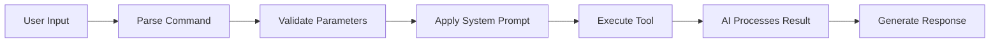

# useAIChatCommand

The `useAIChatCommand` hook allows you to register AI chat commands that send targeted messages to the LLM. These commands are executed by the AI using specific frontend tools and can include custom system prompts for specialized behavior.

## Syntax

```typescript
interface AIChatCommand {
  name: string;
  description: string;
  parameters: ZodSchema;
  toolName: string;
  systemPrompt?: string;
}

function useAIChatCommand(command: Omit<AIChatCommand, 'type'>): void
```

## Parameters

| Property | Type | Required | Description |
|----------|------|----------|-------------|
| `name` | `string` | Yes | Unique command identifier (used with `/` prefix) |
| `description` | `string` | Yes | Clear description for the command |
| `parameters` | `ZodSchema` | Yes | Zod schema defining the command's parameters |
| `toolName` | `string` | Yes | Name of the frontend tool the AI should use |
| `systemPrompt` | `string` | No | Optional system prompt to customize AI behavior |

## Command Registration

### Basic Example

```tsx
import { useAIChatCommand } from "ai-chat-bootstrap";
import { z } from "zod";

function MyCommands() {
  useAIChatCommand({
    name: "summarize",
    description: "Summarize a URL using AI",
    toolName: "url_summarizer",
    parameters: z.object({
      url: z.string().describe("URL to summarize"),
      style: z.enum(["brief", "detailed", "bullet-points"])
        .default("brief")
        .describe("Summary style"),
    }),
    systemPrompt: "You are a concise summarizer. Extract key points and main ideas. Be factual and objective."
  });

  return null;
}
```

### Multiple AI Commands

```tsx
function AICommands() {
  // Search command
  useAIChatCommand({
    name: "search",
    description: "Search and analyze content",
    toolName: "web_search",
    parameters: z.object({
      query: z.string().describe("Search query"),
      maxResults: z.number().default(5).describe("Maximum number of results"),
    }),
    systemPrompt: "You are a research assistant. Find relevant information and provide comprehensive analysis."
  });

  // Code generation command
  useAIChatCommand({
    name: "generate",
    description: "Generate code based on requirements",
    toolName: "code_generator",
    parameters: z.object({
      language: z.enum(["javascript", "typescript", "python", "java"])
        .describe("Programming language"),
      description: z.string().describe("What the code should do"),
      framework: z.string().optional().describe("Framework to use"),
    }),
    systemPrompt: "You are an expert programmer. Generate clean, efficient, and well-commented code."
  });

  // Analysis command
  useAIChatCommand({
    name: "analyze",
    description: "Analyze data and provide insights",
    toolName: "data_analyzer",
    parameters: z.object({
      data: z.string().describe("Data to analyze (JSON, CSV, or text)"),
      type: z.enum(["statistical", "sentiment", "trends"])
        .describe("Type of analysis"),
    }),
    systemPrompt: "You are a data analyst. Provide clear insights and actionable recommendations."
  });

  return null;
}
```

## How AI Commands Work

1. **User Input**: User types `/command` with parameters
2. **Command Parsing**: System parses the command and validates parameters
3. **Tool Mapping**: Command is mapped to its associated frontend tool
4. **AI Execution**: AI receives the command with system prompt and executes the tool
5. **Response**: AI provides response based on tool results and system prompt

## Parameter Schemas

### Simple Parameters

```tsx
parameters: z.object({
  url: z.string().url().describe("Valid URL to process"),
  depth: z.number().min(1).max(3).default(1).describe("Crawl depth"),
})
```

### Complex Parameters

```tsx
parameters: z.object({
  source: z.union([
    z.string().url(),
    z.string().startsWith("file://"),
  ]).describe("Source URL or file path"),
  
  options: z.object({
    format: z.enum(["json", "markdown", "html"]).default("markdown"),
    includeMetadata: z.boolean().default(false),
    maxLength: z.number().optional(),
  }).describe("Processing options"),
  
  filters: z.array(z.string()).optional().describe("Content filters"),
})
```

### Optional Parameters with Defaults

```tsx
parameters: z.object({
  query: z.string().describe("Search query"),
  limit: z.number().default(10).describe("Result limit"),
  sortBy: z.enum(["relevance", "date", "popularity"])
    .default("relevance")
    .describe("Sort order"),
  includeArchived: z.boolean().default(false).describe("Include archived items"),
})
```

## System Prompts

System prompts customize how the AI behaves when executing commands:

### Concise Responses

```tsx
systemPrompt: "Be extremely concise. Provide only essential information in bullet points."
```

### Detailed Analysis

```tsx
systemPrompt: `You are an expert analyst. When analyzing content:
1. Identify key themes and patterns
2. Provide statistical insights where relevant
3. Highlight important relationships
4. Suggest actionable recommendations
5. Include confidence levels for your findings`
```

### Role-Specific Behavior

```tsx
systemPrompt: "You are a senior software architect. Focus on design patterns, scalability, and best practices. Consider performance implications and maintainability."
```

## Complete Integration Example

```tsx
"use client";
import React from "react";
import { 
  ChatContainer, 
  useAIChat, 
  useAIChatCommand,
  useAIFrontendTool 
} from "ai-chat-bootstrap";
import { z } from "zod";

export function ChatWithAICommands() {
  // Register the frontend tool that AI commands will use
  useAIFrontendTool({
    name: "url_summarizer",
    description: "Summarize content from a URL",
    parameters: z.object({
      url: z.string().url(),
      style: z.enum(["brief", "detailed", "bullet-points"]),
    }),
    execute: async (params) => {
      try {
        const response = await fetch(`/api/summarize`, {
          method: 'POST',
          headers: { 'Content-Type': 'application/json' },
          body: JSON.stringify(params),
        });
        
        const result = await response.json();
        return {
          success: true,
          summary: result.summary,
          wordCount: result.wordCount,
          keyPoints: result.keyPoints,
        };
      } catch (error) {
        return {
          success: false,
          error: error.message,
        };
      }
    },
  });

  // Register AI command that uses the tool
  useAIChatCommand({
    name: "summarize",
    description: "Summarize a URL using AI",
    toolName: "url_summarizer",
    parameters: z.object({
      url: z.string().url().describe("URL to summarize"),
      style: z.enum(["brief", "detailed", "bullet-points"])
        .default("brief")
        .describe("Summary style"),
    }),
    systemPrompt: `You are a professional summarizer. Based on the summary style:
    - brief: 2-3 sentences capturing the main idea
    - detailed: comprehensive summary with all key points
    - bullet-points: organized list of main points
    Always be factual and objective.`
  });

  const chat = useAIChat({
    api: "/api/chat",
    systemPrompt: "You are a helpful assistant with access to specialized commands.",
  });

  return (
    <div className="h-[600px] w-full">
      <ChatContainer
        title="AI Assistant with Commands"
        subtitle="Try: /summarize url:https://example.com style:brief"
        messages={chat.messages}
        input={chat.input}
        onInputChange={chat.handleInputChange}
        onSubmit={chat.handleSubmit}
        isLoading={chat.isLoading}
        placeholder="Type / to see available commands"
      />
    </div>
  );
}
```

## Command Execution Flow



## Best Practices

1. **Clear Naming**: Use descriptive command names that indicate their purpose
2. **Parameter Descriptions**: Add clear descriptions for all parameters
3. **System Prompts**: Craft specific prompts for each command's intended behavior
4. **Tool Alignment**: Ensure the tool name matches a registered frontend tool
5. **Error Handling**: Tools should handle errors gracefully
6. **Validation**: Use strict Zod schemas to validate input
7. **Documentation**: Document available commands for users

## TypeScript Interface

```typescript
interface AIChatCommand {
  type: 'ai';
  name: string;
  description: string;
  parameters: z.ZodSchema;
  toolName: string;
  systemPrompt?: string;
}

type CommandRegistration = Omit<AIChatCommand, 'type'>;
```

## Common Command Patterns

- **Data Processing**: Summarize, analyze, transform data
- **Content Generation**: Create documents, code, or designs
- **Research**: Search, compile, and synthesize information
- **Automation**: Execute complex multi-step workflows
- **Integration**: Connect with external services via tools

## Difference from UI Commands

| Feature | AI Commands | UI Commands |
|---------|------------|-------------|
| Execution | Through AI/LLM | Direct client-side |
| System Prompts | Supported | Not applicable |
| Tool Usage | Required | Not required |
| Response | AI-generated | Programmatic |
| Flexibility | High (AI interpretation) | Exact (coded behavior) |

## See Also

- [useUIChatCommand](/api/hooks/use-ui-chat-command) - Register UI commands for direct execution
- [useAIFrontendTool](/api/hooks/use-ai-frontend-tool) - Register tools that commands can use
- [Commands Guide](/chat/commands) - Complete guide to using commands
- [useAIChat](/api/hooks/use-ai-chat) - Main chat hook